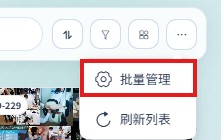
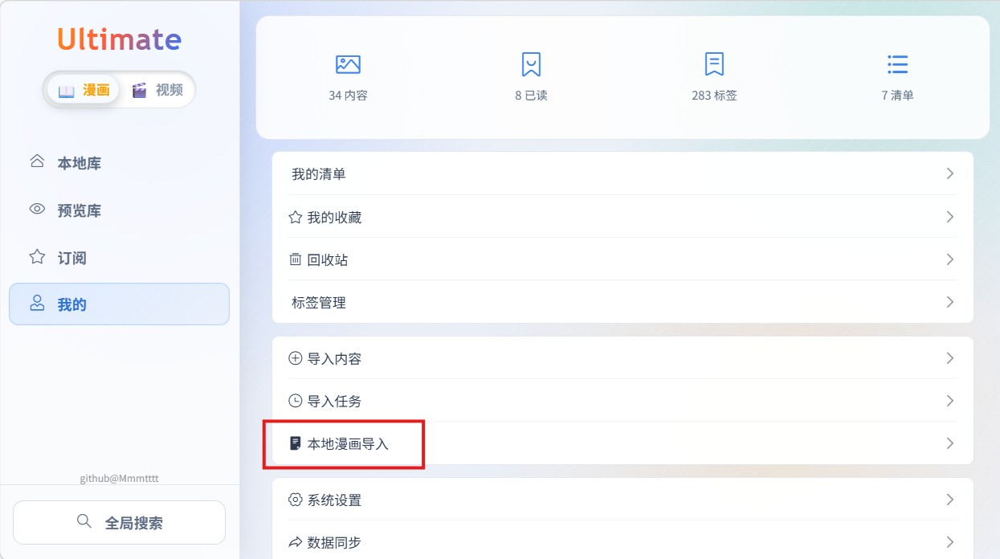
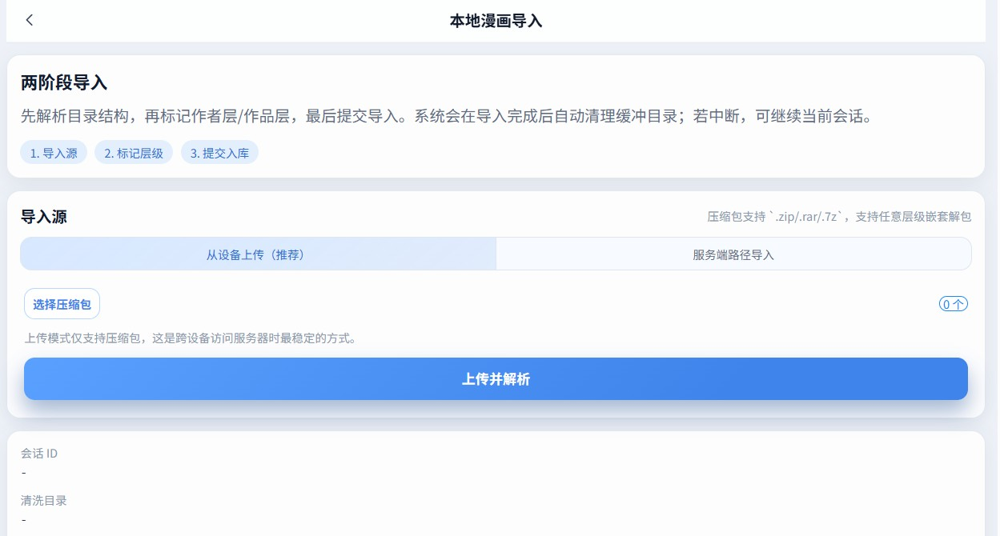
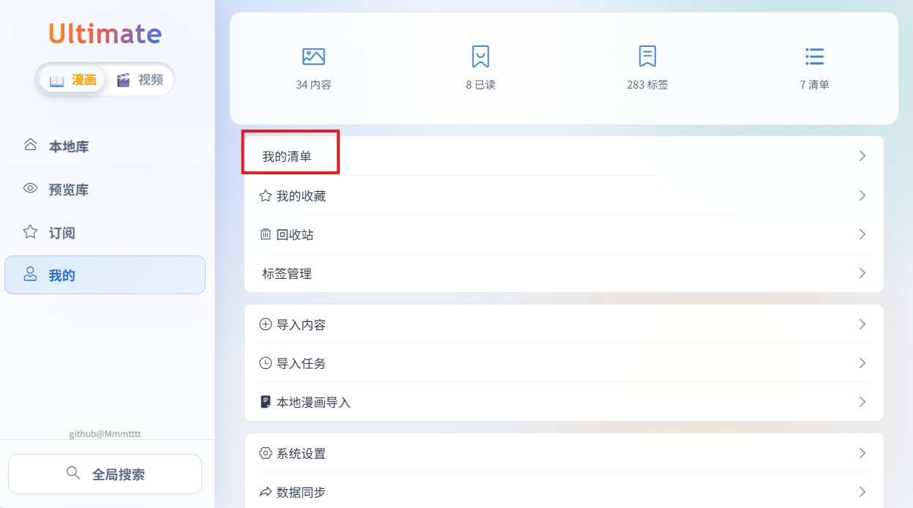
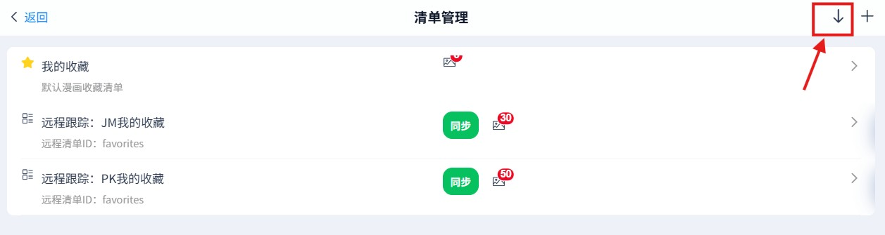
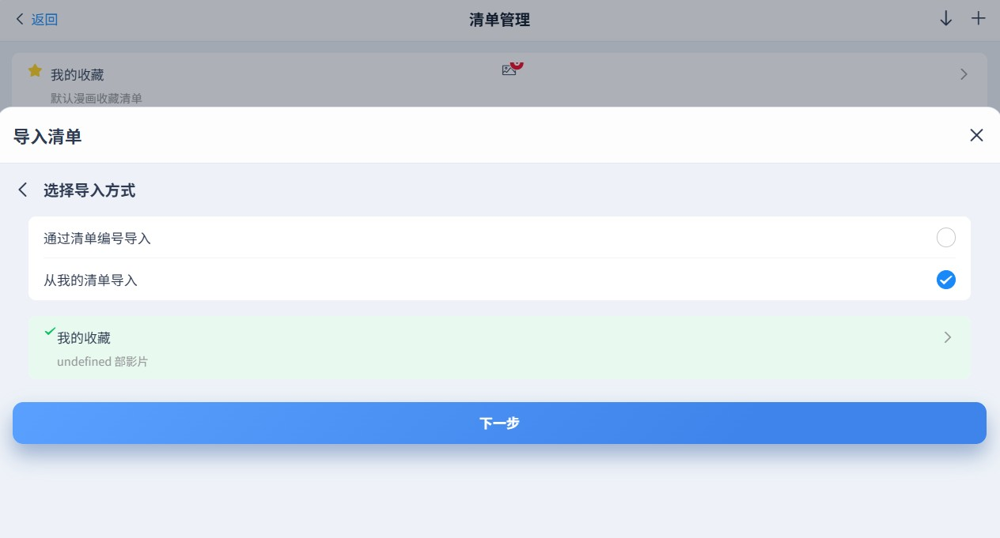
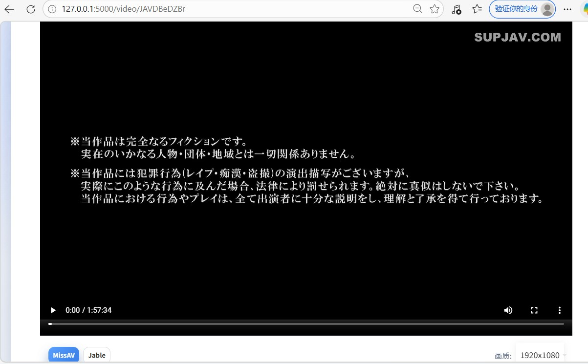
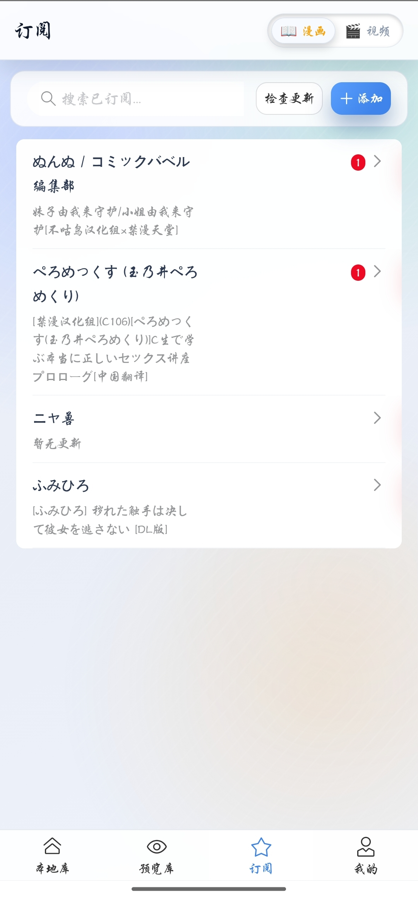
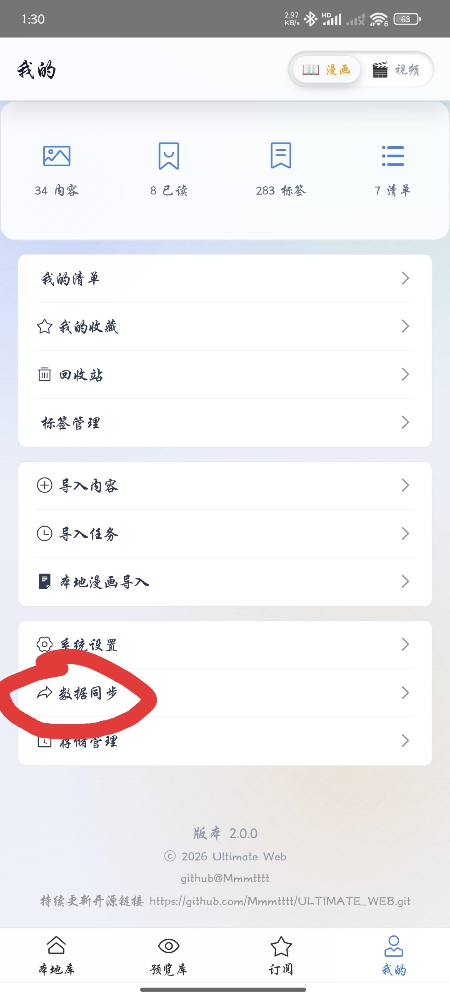
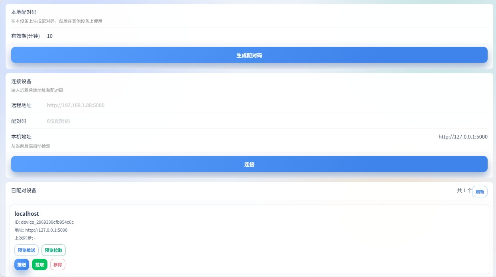

# 🎯 Ultimate Web - 你的私人漫画与视频管家

> **你的硬盘里是不是躺着几百个 G 的本子和电影，却从来不想打开看？**
> 
> **各个平台的收藏夹里塞满了"下次一定"，结果"下次"永远不来？**
> 
> **别慌，这个项目就是为你准备的！**

---

## 🤔 你是不是也有这些烦恼？

### 痛点一：电影、本子太多，管理太累

> "我下载了几千部电影和上万本本子和，文件夹一层套一层，囤积综合征犯了..."
> 
> "每次想看的时候，翻来翻去找不到，最后干脆不看了..."
> 
> "有些本子下载了就再也没打开过，纯属积灰..."

### 痛点二：收藏分散，来回切换

> "JM 上收藏了一些，PK 上收藏了一些，JavDB 上又收藏了一些..."
> 
> "想看某个内容，得先回忆是在哪个平台，然后打开对应的 App..."
> 
> "平台之间不互通，收藏夹乱成一锅粥..."

### 痛点三：标签混乱，难以筛选

> "想找'画工好'的'纯爱'本子，翻了几十页也找不到..."
> 
> "有些电影或漫画忘了打标签，或者平台上的标签完全不对，想找的时候完全想不起来..."
> 
> "评分全靠记忆，好本子和烂本子混在一起..."

---

## ✨ Ultimate Web 来拯救你！

**一句话概括**：Ultimate Web 是一个"内容聚合管理平台"——它可以把你在各大平台的收藏同步过来，也可以管理你本地下载的本子，统一管理、统一阅读、统一观看。

### 🌟 核心功能一览

| 功能 | 说明 | 解决什么问题 |
|------|------|-------------|
| 📂 **本地漫画、电影管理** | 导入本地本子或者电影，自动识别信息，在线阅读和观看 | 本子太多太乱，找不到、不想看 |
| 🔄 **收藏夹同步** | 一键同步 JM、PK、JavDB 的收藏内容 | 平台分散，来回切换太累 |
| 🔍 **全网搜索** | 在一个地方搜索所有平台的内容 | 找内容要开好几个网站 |
| 📚 **在线阅读** | 漫画直接在线看，支持多种翻页模式 | 不用再解压、翻文件夹 |
| 🎬 **在线播放** | 视频一键播放，支持多清晰度切换 | 视频管理更方便 |
| 🏷️ **标签系统** | 给内容打标签，按标签筛选 | 找内容快到飞起 |
| ⭐ **评分系统** | 1-12 分精细评分，按评分排序 | 好内容一目了然 |
| 📋 **清单功能** | 创建"待看清单"、"神作清单"等 | 分类管理更清晰 |
| 👤 **订阅追更** | 关注作者/演员，一键检查更新 | 不错过任何新作 |
| 📱 **多端同步** | 电脑、手机数据互通 | 随时随地访问 |

---

## � 本地库 vs 预览库 —— 两种模式，任你选择

> **还在纠结要不要下载？先预览再说！**

 Ultimate Web 独创性地设计了两套存储体系，满足不同场景需求：

### 📂 本地库 —— 你的私人数据中心

- 所有资源都被**下载到本地**，存储在你的硬盘里
- **优点**：离线也能看，不受网络波动影响，访问速度最快
- **缺点**：比较占用存储空间，几百本本子轻松占用几十 GB

### 🔗 预览库 —— 轻量化新体验

- 大多以**链接形式存在**，不占用本地空间
- 必要时会**下载到缓存**中（可以随时清除）
- **优点**：轻量化，不占空间，想看什么先预览，觉得好再导入本地库
- **缺点**：需要网络连接

### 💡 实用技巧

> **我的习惯是**：先用预览库"预览"一圈，筛选出真正喜欢的，再导入本地库深度阅读。这样既不会浪费硬盘空间，又能找到真正想看的内容！

---

## �🎬 功能演示

### 演示零：预览库 —— 轻量化尝鲜，想看再看

> **场景**：你只是想"先看看"，不确定要不要下载...

**操作步骤**：
1. 在搜索结果中点击任意内容
2. 直接进入详情页，可以在线阅读或播放
3. 觉得喜欢？点击「导入本地库」按钮，下载到本地库

在预览库页面，点击批量管理，选中内容即可导入到本地库
4. 觉得一般？直接关掉，缓存会自动清理（也可以手动一键清除）

**效果**：
- ✅ 不占空间，先看再决定
- ✅ 觉得好再下载，不冲动消费
- ✅ 缓存可以随时清除，零负担

---

### 演示一：本地库导入 —— 让积灰的本子重见天日

> **场景**：你有一个文件夹，里面躺着 200 本下载好的本子、视频等，从来没整理过...

**【本地库界面截图，展示漫画卡片列表】**


**操作步骤**：
1. 点击「导入」→ 选择本地文件夹
2. 系统自动扫描并识别漫画信息
3. 完成！现在你可以在线阅读、打标签、评分了

**【导入本地漫画的操作截图】**




系统会自动扫描文件夹，识别出本子信息，并生成卡片哦。不管嵌套的目录多深，有多少个压缩包，系统都能识别！！

**效果**：
- ✅ 本子从"文件夹地狱"变成"精美卡片墙"
- ✅ 不用解压，直接在线看
- ✅ 打标签、评分、加清单，管理井井有条

---

### 演示二：收藏夹大整合 —— 一个页面全搞定

> **场景**：你在 JM 收藏了 200 本，PK 收藏了 100 本，JavDB 收藏了 50 部...

**【同步收藏夹的操作截图】**





**操作步骤**：
1. 配置平台账号（只需一次） 重要！！！ 没有账号密码怎么知道你收藏了哪些（笑）
2. 按照图片指示同步清单（JM和PK平台的清单就是收藏夹啦，，javdb平台有很多清单，都能导入哦）
3. 等待同步完成，耐心。。。


**效果**：
- ✅ 所有收藏集中在一个页面
- ✅ 不用来回切换 App
- ✅ 数据存在本地，不怕平台跑路

---

### 演示三：标签筛选 —— 两秒找到想看的

> **场景**：想找"画工好"的"纯爱"本子，翻了几十页...

**【标签筛选界面截图】**


**操作步骤**：
1. 点击「筛选」按钮
2. 选择标签："画工好" + "纯爱"
3. 瞬间出结果！

**【排序结果截图】**


**效果**：
- ✅ 多标签组合筛选，精准定位
- ✅ 支持排除标签（不要 NTR？排除掉！）
- ✅ 按评分、时间、阅读状态排序

**超级强大的筛选、排序功能，你值得拥有！（是否有些过于强大了，笑）**
---

### 演示四：在线阅读 —— 翻文件夹？不存在的

> **场景**：想看某本本子，得先解压、翻文件夹、找图片...

（嗯，这个就不展示了，找不到可以放上来的图片...

**操作步骤**：
1. 点击漫画卡片
2. 点击「开始阅读」
3. 左右滑动翻页，双指缩放


**效果**：
- ✅ 支持左右翻页、上下滚动两种模式
- ✅ 支持图片连续显示、单页显示两种模式
- ✅ 阅读进度自动保存
- ✅ 全屏沉浸式阅读

个人觉得体验非常好！本人有完美主义倾向

---

### 演示五：在线播放 —— ？？？做出来这个功能的时候我自己都震惊到了

> **场景**：自动找MISSAV、jable上的对应电影，在线播放！！（小声点，悄悄地用就行）


**操作步骤**：
1. 导入电影后，直接点击播放按钮就可以了

**【视频播放截图】**


man，，what can i say！

**效果**：
- ✅ 支持更换视频源
- ✅ 支持更换清晰度

一个字，绝

---

### 演示六：订阅追更 —— 不错过任何新作

> **场景**：喜欢的作者更新了，但你不知道...

**【订阅列表界面截图】**



**操作步骤**：
1. 在漫画详情页点击「关注作者」
2. 定期点击「检查更新」
3. 一键导入新作品

**效果**：
- ✅ 关注的作者/演员一目了然
- ✅ 一键检查所有订阅的更新
- ✅ 批量导入新作品

---

### 演示七：多端同步 —— 手机电脑数据互通

> **场景**：电脑上整理好的内容，想在手机上看...

**【数据同步1】**



**操作步骤**：
1. 电脑端运行服务，点击数据同步，点击生成配对码
2. 手机安装 App，配置电脑端的服务器地址，输入配对码
3. 点击配对
4. 点击「同步」，数据秒传

**【数据同步2】**



**效果**：
- ✅ 电脑整理，手机看
- ✅ 增量同步，省流量
- ✅ 离线也能看已缓存内容

---

## 🚀 怎么使用？

### 第一步：获取项目

有两种方式，选择适合你的：

---

#### 方式一：下载打包好的程序（推荐新手）

**最简单的方式！** 直接下载打包好的程序，无需安装任何依赖。

1. 打开项目主页：[https://github.com/Mmmtttt/ULTIMATE_WEB](https://github.com/Mmmtttt/ULTIMATE_WEB)
2. 点击右侧的 **Releases** 栏
3. 下载对应平台的程序包：
   - **Windows**：`UltimateWeb_Windows_x.x.x.zip`
   - **Linux**：`UltimateWeb_Linux_x.x.x.tar.gz`
   - **Android**：`UltimateWeb_Android_x.x.x.apk`
4. 解压后直接运行即可

**优点**：
- ✅ 无需安装 Python、Node.js 等环境
- ✅ 解压即用，开箱即用
- ✅ 适合不想折腾的用户

---

#### 方式二：克隆源码并安装依赖（适合开发者）

如果你想自己编译或参与开发，可以克隆源码：

```bash
# 克隆仓库并同步子模块
git clone --recursive https://github.com/Mmmtttt/ULTIMATE_WEB.git

# 如果忘记带子模块
git submodule update --init --recursive
```

然后安装依赖：
```bash
# 后端依赖
cd ULTIMATE_WEB/comic_backend
pip install -r requirements.txt

# 前端依赖
cd ../comic_frontend
npm install
```

---

### 第二步：选择工作模式

| 模式 | 适合人群 | 优点 | 缺点 |
|------|----------|------|------|
| **Windows 内网服务器** | 有电脑，想在家用手机访问 | 设置简单，功能完整 | 电脑要开着 |
| **Linux 公网服务器** | 有云服务器，想随时访问 | 随时随地，24小时运行 | 需要购买服务器 |
| **安卓 App** | 主要用手机，没有电脑 | 最简单，离线也能用 | 部分功能需配合服务器 |

---

### 模式一：Windows 内网服务器（推荐新手）

**如果你下载了打包程序**：
1. 解压 `UltimateWeb_Windows_x.x.x.zip`
2. 双击运行 `start.exe`
3. 浏览器访问 `http://localhost:5173`

**如果你克隆了源码**：
```powershell
.\scripts\start_project.ps1
```

**手机访问**：
- 确保手机和电脑连同一个 WiFi
- 在手机浏览器输入 `http://你的电脑IP:5173`

---

### 模式二：Linux 公网服务器

```bash
# 上传并解压
tar -xzf UltimateWeb_Linux_x.x.x.tar.gz
./start
```

配置 Nginx 反向代理后，即可通过域名访问。

---

### 模式三：安卓 App

1. 下载并安装 APK
2. 打开 App 即可使用
3. 如需同步服务器数据，在设置中配置服务器地址

**⚠️ 安卓端功能说明**：

| 功能 | Windows/Linux | 安卓端 |
|------|:-------------:|:------:|
| 本地库管理 | ✅ | ✅ |
| 在线阅读/播放 | ✅ | ✅ |
| 标签/清单/订阅 | ✅ | ✅ |
| 全网搜索 | ✅ | ❌ |
| 第三方同步 | ✅ | ❌ |

安卓端建议搭配 Windows/Linux 服务器使用：服务器负责同步和搜索，App 负责阅读和同步数据。

---

### 第三步：配置账号密码和cookie
这里的账号密码只保存在本地哦，毕竟这是开源项目

配置方法：
在 我的页面 -》 系统设置 -》 第三方平台配置 中配置
---

## 📱 功能详细说明

### 1. 本地漫画管理

**这是本项目的核心功能之一！** 专为那些"下载了本子却不想看"的用户设计。

**功能亮点**：
- 📂 **批量导入**：选择文件夹，自动扫描所有漫画
- 🔍 **智能识别**：自动解析漫画信息（标题、作者、页数）
- 📖 **在线阅读**：不用解压，直接看
- 🏷️ **标签管理**：给本子打标签，方便筛选
- ⭐ **评分系统**：给本子评分，好本子不埋没

---

### 2. 收藏夹同步

支持同步以下平台的收藏：
- **JM（禁漫天堂）**：同步收藏夹内容
- **PK（哔咔漫画）**：同步收藏夹内容
- **JavDB**：同步收藏的视频

**配置方法**：
1. 编辑 `comic_backend/third_party_config.json`
2. 填入平台账号密码
3. 在清单管理页面点击「同步」

---

### 3. 搜索功能

| 搜索类型 | 说明 |
|----------|------|
| **本地搜索** | 在已导入内容中搜索 |
| **预览库搜索** | 在推荐内容中搜索 |
| **全网搜索** | 搜索 JM、PK、JavDB 全平台 |

**全网搜索技巧**：
- 支持多选，批量导入
- 搜索结果可直接查看详情

---

### 4. 阅读器功能

| 操作 | 说明 |
|------|------|
| **翻页** | 左右滑动或点击屏幕两侧 |
| **缩放** | 双指捏合或鼠标滚轮 |
| **全屏** | 点击全屏按钮 |
| **跳页** | 点击页码快速跳转 |
| **切换模式** | 左右翻页 / 上下滚动 |

阅读进度自动保存，下次打开继续看！

---

### 5. 标签系统

- ➕ 创建新标签
- ✏️ 编辑标签名称
- 📌 批量给内容打标签
- 🔍 按标签筛选内容
- 🚫 排除不想看的标签

---

### 6. 清单功能

- 📋 创建清单（如"我的最爱"、"待看清单"）
- ➕ 把内容加入清单
- 🔄 同步平台清单
- 📥 批量下载清单内的漫画

---

### 7. 订阅功能

- 👤 关注喜欢的作者/演员
- 🔔 一键检查更新
- 📥 批量导入新作品

---

### 8. 数据同步

安卓端支持与服务器同步：
- 📚 漫画/视频元数据
- 📖 阅读进度
- 🏷️ 标签和清单
- 👤 订阅的作者/演员

**同步特点**：
- 增量同步，节省流量
- 双向同步，数据互通
- 支持离线阅读

---

## ❓ 常见问题

### Q1：启动失败怎么办？

检查以下几点：
1. 是否安装了 Python 3.13+ 和 Node.js 20+
2. 端口 5000 和 5173 是否被占用
3. 是否正确安装了依赖

### Q2：手机无法访问电脑上的服务？

解决方法：
1. 确保手机和电脑连同一个 WiFi
2. 检查电脑防火墙是否放行端口
3. 使用电脑的局域网 IP（不是 localhost）

### Q3：数据会丢失吗？

**不会！** 系统有三级自动备份：
- 每 10 分钟备份一次
- 每小时备份一次
- 每天备份一次

即使数据损坏，也可以从备份恢复。

### Q4：本地漫画导入后，原文件还在吗？

**在的！** 导入只是建立索引，原文件不会被移动或删除。

### Q5：是否需要科学上网？
**只有在导入内容时才需要。** 你怎么访问JM、PK、JAVDB，就怎样使用这个软件。
---

## � 开发者文档

如果你想参与开发或了解更多技术细节，请查看：

- [开发者手册](开发者文档/开发者手册.md) - 环境配置、打包发布、架构设计
- [三平台构建手册](开发者文档/三平台可执行文件构建手册.md) - Windows/Linux/Android 打包
- [同步设计文档](开发者文档/同步设计与增量传输实现说明.md) - 数据同步机制

---

## 💖 致谢

本项目的开发离不开以下开源项目和作者的贡献：

### 核心依赖

| 项目 | 说明 |
|------|------|
| [JMComic-Crawler-Python](https://github.com/hect0x7/JMComic-Crawler-Python) | JM 禁漫天堂漫画爬虫库，本项目的核心依赖 |

### 代码参考

| 项目 | 说明 |
|------|------|
| [avbook](https://github.com/guyueyingmu/avbook) | 视频图书管理系统的参考实现 |
| [NASSAV](https://github.com/Satoing/NASSAV) | NAS 视频管理方案的参考实现 |

感谢以上开源项目的作者们！

---

## 📜 开源协议

本项目采用 MIT 协议开源，欢迎参与贡献！

---

**如果你觉得这个项目有用，欢迎 Star ⭐ 支持一下！**
