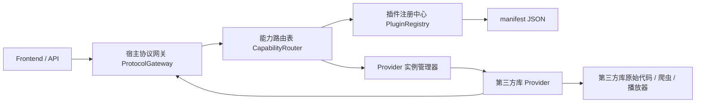

# 第三方库协议说明书

更新时间：2026-04-19  
适用范围：`ULTIMATE_WEB` 当前工作区第三方库重构方案  
目标版本：第三方协议 `v1.0`

---

## 1. 文档目的

本文档用于定义 `ULTIMATE_WEB` 与第三方库之间的统一协议。

本协议的目标不是再做一层新的“宿主侧平台判断”，而是把第三方库的差异性尽可能下放到第三方库内部，让宿主软件只感知：

1. 这个第三方库是谁。
2. 它声明自己支持哪些能力。
3. 它需要哪些配置。
4. 宿主应该如何以统一方式调用它。

因此，本协议采用“双层结构”：

1. `manifest JSON`：静态声明协议，描述插件名称、能力、配置、兼容性、交互动作。
2. `provider 代码接口`：运行时执行协议，负责真正调用第三方库并把结果转换成宿主统一格式。

结论上，这比“只用 JSON 文件完成全部适配”更可行。  
原因是 JSON 只能描述，不能执行；而你要的“宿主完全不感知第三方差异”，必须依赖第三方库自身提供统一执行入口。

---

## 2. 现状排查结论

当前项目已经具备“统一接入”的部分雏形，但还没有形成真正的协议化架构。

### 2.1 已存在的统一化基础

当前代码中已经有以下基础设施：

1. `comic_backend/third_party/base_adapter.py`
   定义了漫画平台适配器的基础接口。
2. `comic_backend/third_party/adapter_factory.py`
   提供适配器工厂和第三方配置管理。
3. `comic_backend/third_party/platform_service.py`
   提供漫画平台层的统一入口。
4. `comic_backend/api/v1/comic.py`
   已经实现了一个基于 schema 的第三方配置接口。
5. `comic_frontend/src/views/SystemConfig.vue`
   已经具备“根据后端 schema 渲染配置表单”的前端雏形。

这些部分说明：当前项目并不是从零开始，后续可以在现有基础上演进，而不是完全推倒重做。

### 2.2 当前的核心问题

排查后发现，第三方库接入目前仍然存在“四套路径并存”的问题：

1. 漫画平台主要走 `base_adapter + adapter_factory + platform_service`。
2. 漫画的作者、部分导入逻辑仍直接走 `third_party.external_api`。
3. 视频平台在 `comic_backend/api/v1/video.py` 中仍直接按平台名实例化具体适配器。
4. 在线播放又额外走 `third_party.missav` 包装层。

这会带来几个直接问题：

1. 宿主仍然知道 `jmcomic`、`picacomic`、`javdb`、`javbus`、`missav` 这些具体实现。
2. 哪个平台支持什么能力，不是“声明出来”的，而是靠代码里的 `if/elif` 分支隐式判断。
3. 配置结构还是“按内置 adapter 名称写死”，新接入一个第三方库时，宿主还要继续改后端接口和前端表单。
4. 不同第三方库之间能力差异很大，但当前没有统一的能力模型。

### 2.3 当前第三方能力全量范围

根据现有代码与测试，第三方能力至少覆盖以下范围：

#### 漫画能力

1. 搜索漫画。
2. 获取漫画详情。
3. 获取收藏夹。
4. 获取收藏夹轻量信息。
5. 获取用户清单。
6. 获取清单详情。
7. 下载整本漫画。
8. 下载封面。
9. 获取预览图 URL。
10. 为本地 `LOCAL` 漫画补全远程元数据。

#### 视频能力

1. 搜索视频。
2. 获取视频详情。
3. 按演员搜索。
4. 获取演员作品。
5. 按标签搜索。
6. 获取用户清单。
7. 获取清单详情。
8. 获取首页/推荐流导入内容。
9. 构建在线播放源。
10. 代理播放请求与 m3u8/key/分片转发。
11. 为本地 `LOCAL` 视频补全远程元数据。
12. 下载封面、缩略图、预览视频等资源。

#### 配置与交互能力

1. 账号密码配置。
2. Cookie 配置。
3. 启用/禁用配置。
4. 域名索引等平台参数配置。
5. 配置状态校验。
6. Cookie 获取教程等交互辅助动作。

### 2.4 当前测试基础

项目已经有大量第三方相关测试，可作为协议迁移期的回归护栏：

1. `tests/features/third_party_integration/integration/*`
2. `tests/features/third_party_integration/e2e/*`

这意味着本次重构完全可以采用“保持对外功能不变、内部协议切换”的双轨迁移策略。

---

## 3. 设计目标

本协议必须同时满足以下目标：

1. 宿主不再感知具体第三方库差异，只感知“能力”和“协议”。
2. 第三方库自己声明支持能力，不允许宿主再写一堆硬编码平台判断。
3. 宿主可以动态发现、启用、禁用、排序第三方库。
4. 宿主可以根据协议自动生成配置界面。
5. 第三方库可以声明交互式配置动作，例如“打开登录页”“检测登录状态”“校验 Cookie”。
6. 第三方库只需实现协议，不需要修改宿主业务代码即可接入。
7. 必须支持能力缺省。不是所有第三方库都支持所有能力。
8. 必须支持未来继续扩展新的媒体类型、能力类型和配置项。
9. 必须支持迁移期兼容旧实现，保证当前功能完全不变。

---

## 4. 总体架构

### 4.1 总体思想

宿主只维护“协议内核”，第三方库维护“能力实现”。



### 4.2 关键边界

宿主负责：

1. 插件发现与加载。
2. 配置存储与密文管理。
3. 能力路由。
4. 超时、缓存、日志、任务调度。
5. 本地数据库写入与业务编排。
6. 对前端保持原有 API 不变。

第三方库负责：

1. 声明自己是谁。
2. 声明自己支持哪些能力。
3. 声明自己需要哪些配置。
4. 执行统一 `provider` 接口。
5. 把上游返回值转换成宿主标准模型。
6. 在自身内部消化平台差异。

### 4.3 协议组成

协议由三部分组成：

1. 插件清单协议 `manifest`
2. 运行时调用协议 `request/response`
3. 配置与交互协议 `configuration/action`

---

## 5. 插件落地形态

因为这些第三方库本身也是你自己写的，推荐把适配层直接放到第三方库仓库内部，而不是继续放在宿主侧。

推荐结构如下：

```text
comic_backend/
  third_party/
    JMComic-Crawler-Python/
      ultimate-plugin.json
      ultimate_provider.py
      schemas/
      ...
    Picacomic-Crawler/
      ultimate-plugin.json
      ultimate_provider.py
      schemas/
      ...
    javdb-api-scraper/
      ultimate-plugin.json
      ultimate_provider.py
      schemas/
      ...
    Missav/
      ultimate-plugin.json
      ultimate_provider.py
      schemas/
      ...
```

宿主扫描路径：

1. 首选：`comic_backend/third_party/**/ultimate-plugin.json`
2. 兼容期可额外支持：`comic_backend/third_party_plugins/**/ultimate-plugin.json`

这样做的好处是：

1. 适配逻辑真正下放到第三方库。
2. 新增/删除第三方库时，宿主不用继续改一堆平台注册代码。
3. 第三方库升级时，协议声明与执行代码在同一个地方维护。

---

## 6. 插件清单协议 `ultimate-plugin.json`

### 6.1 顶层结构

```json
{
  "protocol_version": "1.0",
  "plugin": {
    "id": "video.javdb",
    "name": "JAVDB",
    "version": "1.2.0",
    "vendor": "mmmtttt",
    "entrypoint": "ultimate_provider:JavdbProvider"
  },
  "runtime": {
    "language": "python",
    "min_host_version": "2026.04",
    "load_mode": "inproc"
  },
  "media_types": ["video"],
  "capabilities": [],
  "configuration": {},
  "compatibility": {}
}
```

### 6.2 顶层字段定义

| 字段 | 类型 | 必填 | 说明 |
|---|---|---|---|
| `protocol_version` | string | 是 | 协议版本，宿主据此判断兼容性 |
| `plugin.id` | string | 是 | 插件唯一标识，推荐 `媒体.平台` 形式 |
| `plugin.name` | string | 是 | 显示名称 |
| `plugin.version` | string | 是 | 插件自身版本 |
| `plugin.vendor` | string | 否 | 插件维护者 |
| `plugin.entrypoint` | string | 是 | provider 入口，格式 `模块:类名` |
| `runtime.language` | string | 是 | 当前建议固定为 `python` |
| `runtime.min_host_version` | string | 否 | 最低宿主版本 |
| `runtime.load_mode` | string | 否 | 当前建议固定为 `inproc` |
| `media_types` | array | 是 | 支持的媒体类型，例如 `comic`、`video` |
| `capabilities` | array | 是 | 能力声明列表 |
| `configuration` | object | 否 | 配置表单和交互动作声明 |
| `compatibility` | object | 否 | 兼容旧 ID/旧平台名/旧接口的声明 |

---

## 7. 能力声明协议

### 7.1 设计原则

能力必须声明为“标准能力 key”，而不是“宿主直接调某个第三方方法名”。

宿主只看能力 key，例如：

1. `catalog.search`
2. `catalog.detail`
3. `collection.list`
4. `collection.detail`
5. `collection.favorites`
6. `person.search`
7. `person.works`
8. `taxonomy.tags`
9. `asset.cover.fetch`
10. `asset.preview.resolve`
11. `playback.sources.build`
12. `playback.proxy.forward`
13. `maintenance.local.enrich`
14. `health.auth.check`

### 7.2 能力对象结构

```json
{
  "key": "catalog.search",
  "media_type": "video",
  "display_name": "搜索视频",
  "supports": {
    "pagination": true,
    "keyword": true,
    "tag_filter": false,
    "person_filter": false,
    "batch": false
  },
  "input_schema": {
    "required": ["keyword"],
    "properties": {
      "keyword": { "type": "string" },
      "page": { "type": "integer", "default": 1 },
      "page_size": { "type": "integer", "default": 20 }
    }
  },
  "output_schema": {
    "result_type": "content_page"
  },
  "auth": {
    "required": false
  },
  "priority": 100
}
```

### 7.3 当前项目建议的标准能力全集

| 能力 key | 媒体 | 说明 | 当前来源 |
|---|---|---|---|
| `catalog.search` | comic/video | 关键字搜索 | JM、PK、JAVDB、JAVBUS |
| `catalog.detail` | comic/video | 根据远程 ID 获取详情 | JM、PK、JAVDB、JAVBUS |
| `catalog.feed` | video | 首页、推荐流、榜单等导入源 | JAVDB 等 |
| `catalog.import_preview` | comic/video | 从远程结果导入到宿主预览库/本地库 | 多平台 |
| `collection.list` | comic/video | 获取远程清单列表 | JM、PK、JAVDB |
| `collection.detail` | comic/video | 获取远程清单详情 | JM、PK、JAVDB |
| `collection.favorites` | comic/video | 获取远程收藏夹 | JM、PK、JAVDB |
| `collection.favorites_basic` | comic/video | 获取远程收藏夹轻量信息 | JM、PK |
| `person.search` | video | 演员搜索 | JAVDB/JAVBUS |
| `person.works` | comic/video | 作者/演员作品 | JM、PK、JAVDB/JAVBUS |
| `taxonomy.tags` | video | 获取可搜索标签 | JAVDB |
| `taxonomy.tag_search` | video | 根据标签搜索 | JAVDB |
| `asset.cover.fetch` | comic/video | 下载封面到本地指定路径 | 多平台 |
| `asset.bundle.fetch` | comic | 下载整本漫画到指定目录 | JM、PK |
| `asset.preview.resolve` | comic/video | 获取预览图或缩略图资源 | JM、PK、JAVDB |
| `asset.preview_video.fetch` | video | 下载预览视频 | JAVDB/JAVBUS |
| `playback.sources.build` | video | 生成在线播放源 | Missav |
| `playback.proxy.forward` | video | 代理转发播放资源 | Missav |
| `maintenance.local.enrich` | comic/video | 为本地 `LOCAL` 记录补全远程信息 | 多平台 |
| `health.auth.check` | comic/video | 检测当前认证状态 | JAVDB、JM、PK |

### 7.4 能力可选，不强制全集实现

不是每个第三方库都需要实现所有能力。

例如：

1. `video.missav` 只需要实现播放相关能力。
2. `comic.jm` 可能不实现 `taxonomy.tags`。
3. `video.javbus` 可能只实现搜索和详情，不实现清单。

宿主必须通过“能力存在与否”来决定功能是否可用，而不是再写平台判断。

---

## 8. 宿主路由协议

宿主不直接绑定平台名，而是维护“能力路由表”。

### 8.1 路由配置示例

```json
{
  "protocol_version": "1.0",
  "routes": {
    "video.catalog.search": {
      "strategy": "fanout_merge",
      "plugin_ids": ["video.javdb", "video.javbus"]
    },
    "video.catalog.detail": {
      "strategy": "fallback",
      "plugin_ids": ["video.javdb", "video.javbus"]
    },
    "video.playback.sources.build": {
      "strategy": "single",
      "plugin_ids": ["video.missav"]
    },
    "comic.catalog.search": {
      "strategy": "fanout_merge",
      "plugin_ids": ["comic.jm", "comic.pk"]
    }
  }
}
```

### 8.2 路由策略

| 策略 | 说明 |
|---|---|
| `single` | 只调用一个插件 |
| `fallback` | 依次尝试，直到成功 |
| `fanout_merge` | 并发调用多个插件并合并结果 |
| `broadcast` | 对多个插件执行同一动作，不合并结果 |

这一步非常关键。  
宿主“完全不感知第三方差别”的前提，不是没有路由，而是路由绑定能力，不绑定业务代码里的平台判断。

---

## 9. 运行时调用协议

### 9.1 固定 provider 接口

每个第三方库必须暴露统一 provider 类，至少实现以下固定接口：

```python
class UltimateProvider:
    def get_manifest(self) -> dict:
        ...

    def validate_config(self, config: dict) -> dict:
        ...

    def health_check(self, scope: str, context: dict) -> dict:
        ...

    def execute(self, capability: str, params: dict, context: dict) -> dict:
        ...

    def shutdown(self) -> None:
        ...
```

宿主只调用这些固定接口，不再调用 `search_albums()`、`build_sources()` 这种平台私有方法。

### 9.2 统一请求格式

```json
{
  "request_id": "req-20260419-0001",
  "plugin_id": "video.javdb",
  "capability": "catalog.search",
  "media_type": "video",
  "params": {
    "keyword": "ABP-123",
    "page": 1,
    "page_size": 20
  },
  "context": {
    "trace_id": "trace-xxx",
    "timeout_ms": 15000,
    "user_action": "manual_search",
    "storage": {
      "data_dir": "D:/.../comic_backend/data"
    }
  }
}
```

### 9.3 统一响应格式

```json
{
  "request_id": "req-20260419-0001",
  "ok": true,
  "plugin_id": "video.javdb",
  "capability": "catalog.search",
  "data": {
    "items": []
  },
  "paging": {
    "page": 1,
    "page_size": 20,
    "has_next": true,
    "total": 120
  },
  "meta": {
    "duration_ms": 430,
    "from_cache": false
  },
  "error": null
}
```

失败时：

```json
{
  "request_id": "req-20260419-0001",
  "ok": false,
  "plugin_id": "video.javdb",
  "capability": "catalog.search",
  "data": null,
  "paging": null,
  "meta": {
    "duration_ms": 120
  },
  "error": {
    "code": "AUTH_REQUIRED",
    "message": "JAVDB cookie is missing or invalid",
    "retryable": false,
    "details": {}
  }
}
```

### 9.4 标准错误码

建议固定以下错误码：

1. `AUTH_REQUIRED`
2. `AUTH_INVALID`
3. `CAPABILITY_NOT_SUPPORTED`
4. `INVALID_PARAMS`
5. `UPSTREAM_UNAVAILABLE`
6. `RATE_LIMITED`
7. `TIMEOUT`
8. `PROXY_FAILED`
9. `DOWNLOAD_FAILED`
10. `INTERNAL_PLUGIN_ERROR`

---

## 10. 标准数据模型

### 10.1 内容对象 `content_item`

```json
{
  "remote_ref": {
    "plugin_id": "video.javdb",
    "remote_id": "abc123"
  },
  "media_type": "video",
  "title": "作品标题",
  "title_original": "",
  "cover_url": "https://...",
  "summary": "",
  "rating": null,
  "tags": [],
  "people": [],
  "extra": {}
}
```

### 10.2 设计要求

1. 所有插件都必须返回宿主能直接理解的标准字段。
2. 插件特有字段允许放到 `extra` 中。
3. 宿主业务代码只依赖标准字段。
4. 只有当确实需要某个扩展能力时，才由宿主显式读取 `extra`。

### 10.3 推荐的 `extra` 分层

```json
{
  "extra": {
    "video": {
      "code": "ABP-123",
      "duration": 5400,
      "magnets": []
    },
    "comic": {
      "pages": 210
    },
    "provider": {
      "raw_platform": "javdb"
    }
  }
}
```

这样既能保留当前细粒度信息，又不会把宿主重新绑死到某个平台。

---

## 11. 配置协议

### 11.1 配置声明原则

配置值不写进 `manifest`，`manifest` 只声明“需要什么配置”和“如何渲染”。

### 11.2 配置结构示例

```json
{
  "configuration": {
    "sections": [
      {
        "id": "basic",
        "label": "基础配置",
        "fields": [
          {
            "key": "enabled",
            "label": "启用",
            "type": "boolean",
            "required": true,
            "default": true
          },
          {
            "key": "cookie_string",
            "label": "Cookie",
            "type": "textarea",
            "required": false,
            "secret": true,
            "placeholder": "_jdb_session=..."
          }
        ]
      }
    ],
    "actions": [
      {
        "id": "open_cookie_guide",
        "label": "打开 Cookie 教程",
        "type": "open_url",
        "url": "/api/v1/config/javdb-cookie-guide"
      },
      {
        "id": "check_auth",
        "label": "检测登录状态",
        "type": "invoke",
        "capability": "health.auth.check"
      }
    ]
  }
}
```

### 11.3 字段类型标准

建议先固定以下字段类型：

1. `boolean`
2. `text`
3. `password`
4. `textarea`
5. `number`
6. `select`
7. `multiselect`
8. `path`

### 11.4 交互动作标准

建议先固定以下动作类型：

1. `open_url`
2. `invoke`
3. `copy_text`
4. `open_local_path`

### 11.5 配置校验流程

宿主保存配置时：

1. 先根据 `manifest` 校验字段结构。
2. 再调用 provider 的 `validate_config()`。
3. 校验通过后写入宿主配置中心。
4. secret 字段只以密文或脱敏形式返回前端。

---

## 12. 交互式协议

这部分专门解决你提到的“用户可能还需要配置第三方库的一些配置信息，而且协议可能需要交互”。

### 12.1 交互场景

当前已知需要交互的场景包括：

1. 登录后获取 Cookie。
2. 检查账号是否仍然有效。
3. 提示用户某个能力因为未认证而不可用。
4. 告诉前端当前哪些第三方能力可用，哪些不可用。

### 12.2 交互返回格式

provider 除了正常数据，还可以返回 `interaction` 指令：

```json
{
  "ok": false,
  "error": {
    "code": "AUTH_REQUIRED",
    "message": "需要先配置 JAVDB Cookie"
  },
  "interaction": {
    "type": "config_required",
    "plugin_id": "video.javdb",
    "section": "basic",
    "fields": ["cookie_string"],
    "actions": ["open_cookie_guide"]
  }
}
```

这样前端就可以根据协议自动弹出配置引导，而不是为每个平台写死提示逻辑。

---

## 13. 宿主协议适配层架构

宿主侧建议新增以下模块：

### 13.1 `PluginRegistry`

职责：

1. 扫描第三方库目录。
2. 读取 `ultimate-plugin.json`。
3. 校验 `manifest` 结构。
4. 建立 `plugin_id -> manifest` 索引。

### 13.2 `ProviderManager`

职责：

1. 根据 `entrypoint` 加载 provider。
2. 维护 provider 生命周期。
3. 注入配置、日志、缓存、数据目录等上下文。
4. 支持配置变更后的 provider 热重载。

### 13.3 `CapabilityRouter`

职责：

1. 维护能力到插件的映射关系。
2. 负责 `single/fallback/fanout_merge/broadcast` 策略。
3. 根据插件是否启用、认证状态、健康状态决定是否可路由。

### 13.4 `ProtocolGateway`

职责：

1. 为业务代码提供唯一调用入口。
2. 屏蔽插件选择、异常处理、重试、超时、日志。
3. 输出统一的结果对象。

业务层以后统一调用类似接口：

```python
gateway.execute(
    capability="catalog.search",
    media_type="video",
    params={"keyword": "ABP-123"},
    route_key="video.catalog.search",
)
```

### 13.5 `PluginConfigService`

职责：

1. 保存插件配置。
2. 提供 schema 给前端。
3. 脱敏 secret 字段。
4. 对接现有 `SystemConfig.vue` 的表单渲染逻辑。

### 13.6 `CompatibilityBridge`

职责：

1. 对老业务代码提供兼容接口。
2. 让迁移可以分阶段完成。
3. 迁移完成后再删除。

---

## 14. 第三方库侧适配层架构

第三方库内部建议统一成三层：

### 14.1 `manifest`

声明：

1. 插件身份。
2. 支持能力。
3. 需要配置。
4. 交互动作。

### 14.2 `provider`

职责：

1. 对宿主暴露统一协议入口。
2. 调用第三方库原始实现。
3. 把原始数据转换为标准模型。
4. 处理认证、错误码、能力检查。

### 14.3 `translator`

职责：

1. 原始上游数据到标准模型的映射。
2. 原始异常到标准错误码的映射。
3. 原始配置格式到协议配置格式的映射。

推荐规则：

1. 爬虫/播放器原始逻辑尽量不改。
2. 协议适配逻辑集中在 `ultimate_provider.py` 和 `translator`。
3. 这样后续第三方库内部升级时，更容易控制影响范围。

---

## 15. 与当前功能的映射关系

### 15.1 漫画链路

当前宿主中的这些功能，未来都应该只通过协议网关触发：

1. 搜索第三方漫画。
2. 获取漫画详情。
3. 导入收藏夹。
4. 导入清单。
5. 下载封面。
6. 下载整本漫画。
7. 获取预览图。
8. `LOCAL` 补全信息。

### 15.2 视频链路

未来统一走协议的能力包括：

1. 视频全网搜索。
2. 视频详情获取。
3. 演员搜索与作品获取。
4. 标签搜索。
5. 清单导入与收藏夹同步。
6. 封面/缩略图/预览视频抓取。
7. 在线播放源构建。
8. 播放代理。
9. `LOCAL` 补全信息。

### 15.3 配置链路

未来配置页面不再写死 `jmcomic/picacomic/javdb` 三个平台，而是：

1. 宿主读取已安装插件列表。
2. 宿主按 `manifest.configuration` 生成配置页面。
3. 前端只渲染协议字段，不关心具体平台差异。

---

## 16. 版本与兼容策略

### 16.1 协议版本

建议使用语义化版本：

1. `1.x`：字段新增、能力扩展，向后兼容。
2. `2.0`：字段含义变化或移除，向后不兼容。

### 16.2 兼容字段

`compatibility` 推荐包含：

```json
{
  "legacy_platform_names": ["javdb", "javbus"],
  "legacy_id_prefixes": ["JAVDB", "JAVBUS"],
  "supports_host_api_versions": ["2026.03", "2026.04"]
}
```

用于迁移期兼容当前宿主已有的数据前缀、接口参数和平台名。

---

## 17. 本协议的最终裁剪建议

为了保证第一版简洁高效，建议协议 `v1.0` 只落地以下必要范围：

1. 固定 `manifest + provider` 双层协议。
2. 固定能力声明结构。
3. 固定配置 schema 和交互 action。
4. 固定统一请求/响应和错误码。
5. 固定宿主能力路由器。
6. 保留 `extra` 扩展字段，不在第一版做更多动态 DSL。

暂时不建议第一版就引入：

1. 任意脚本型动态能力编排。
2. 跨进程插件沙箱。
3. 动态 schema 远程下发。
4. 前端完全动态页面拼装。

这些能力可以以后再加，但不应成为第一版落地阻碍。

---

## 18. 最终结论

本项目最适合的第三方协议方案，不是“宿主继续堆一个更大的适配器工厂”，而是：

1. 宿主只保留协议内核、路由和配置中心。
2. 第三方库通过 `ultimate-plugin.json` 声明能力和配置。
3. 第三方库通过统一 provider 接口对宿主暴露执行入口。
4. 所有平台差异、认证差异、返回结构差异，都由第三方库内部自行消化。
5. 宿主以后按“能力”而不是“平台名”组织业务。

这套方案可以覆盖当前漫画、视频、在线播放、导入、收藏夹、配置交互等所有已存在能力，同时又能支持后续继续新增第三方库和新增功能。
